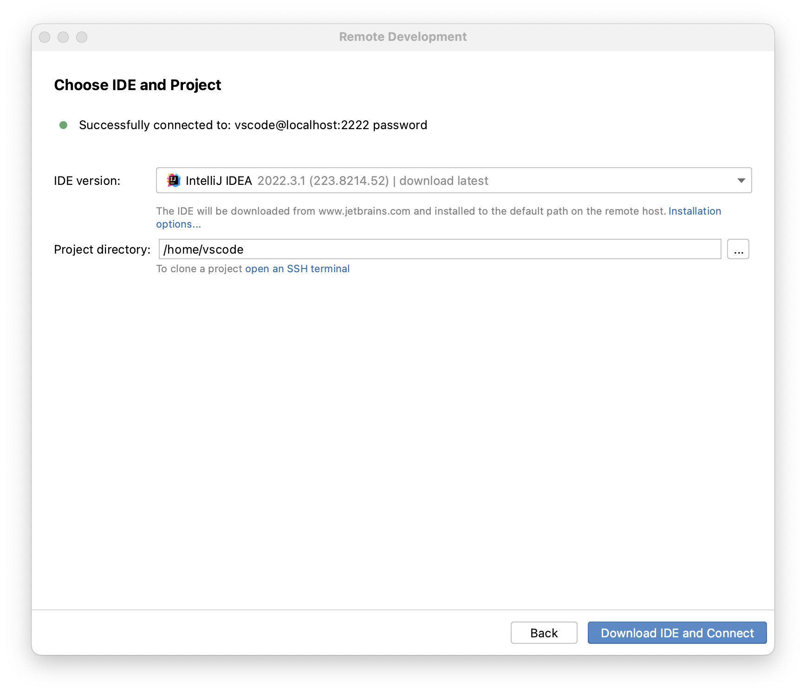
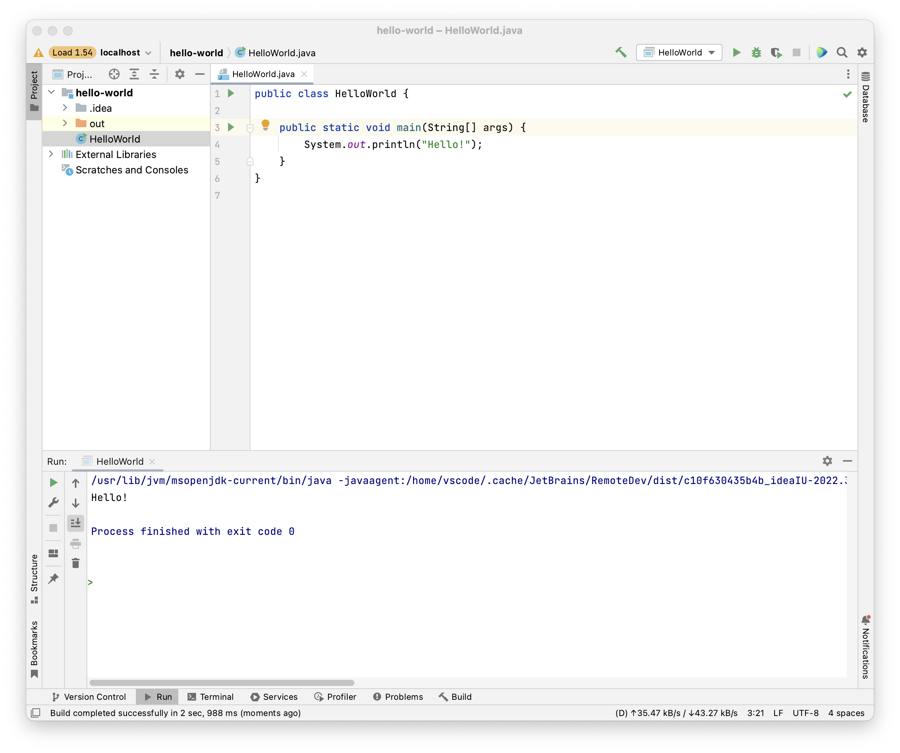

# intellij-playground

📚 Learning and exploring Intellij IDEA.

> IntelliJ IDEA – the Leading Java and Kotlin IDE
> 
> The IDE that makes development a more productive and enjoyable experience
> 
> -- <cite>https://www.jetbrains.com/idea </cite>


## Overview

I originally created this repository to explore  [*Projector*](https://blog.jetbrains.com/blog/2021/03/11/projector-is-out/)
but that project is now discontinued. But, I can still use this repository to explore other things about Intellij like its
support for remote development via SSH, Intellij plugin development, and more.

---
**NOTE**:

This was developed on macOS and for my own personal use.

---


## Container-Based Development via SSH

Intellij and other JetBrains IDEs support [remote development](https://www.jetbrains.com/remote-development/) via cloud
development environments like [JetBrains Space](https://www.jetbrains.com/space/features/dev-environments.html), [GitHub Codespaces](https://github.com/features/codespaces),
or you can [orchestrate your own development environment with SSH](https://www.jetbrains.com/help/idea/remote-development-starting-page.html#start_from_IDE).

I'm a fan of cloud development environments for demos, learning expeditions, and open source collaboration but I generally
want more control and power than what the cloud constrains me to (and what the cloud costs). With that in mind, we can create a container-based
development environment that runs an Intellij *IDE backend* and connect to it from an *IDE client* like Intellij or [Gateway](https://www.jetbrains.com/help/idea/remote-development-a.html#gateway)
via SSH. This is what I'll be exploring in this repository.

To make sense of the components and how they work together, refer to [this architecture diagram in the Intellij docs](https://www.jetbrains.com/help/idea/remote-development-overview.html#defs).

We need to create a Docker image and container that hosts the IDE backend and is complete with the development tooling
we need to work on our projects. For me, I often work on Java projects and so I depend on an installation of OpenJDK.
Personally, I find Microsoft's [Development Containers](https://containers.dev/) project effective and it shows promise for future
investment and improvement. We can define a dev container configuration file (`.devcontainer/devcontainer.json`) and use
the [Dev Container CLI](https://github.com/devcontainers/cli) to define and build our ideal development environment! I
have explored the Development Containers project in the context of VS Code and GitHub Codespaces. You can see my notes and working
examples in my repository <https://github.com/dgroomes/vscode-playground>.

Follow these instructions to create a container-based development environment for Intellij:

1. Pre-requisite: npm
   * I'm using npm version 9.2.0.
2. Pre-requisite: Docker
   * I'm using Docker Desktop 4.15.0
3. Install the *Dev Container CLI*
   * ```shell
     npm install --location=global @devcontainers/cli
     ```
4. Build the image
   * ```shell
     devcontainer build --workspace-folder . --image-name intellij-playground-devcontainer
     ```
   * This did a lot of heavy lifting for us. It created a Docker image that is installed with OpenJDK and an SSH server.
     All we had to do was declare that we wanted those features in our `.devcontainer/devcontainer.json` configuration
     file.
5. Create and start a container from the image
   * ```shell
     docker run --rm --name intellij-playground-devcontainer --publish 2222:2222 --detach intellij-playground-devcontainer /usr/local/share/ssh-init.sh sleep infinity
     ```
   * The peculiarities of this command are something you need to understand and research by reading the Dev Container docs
     and *feature* installation scripts like [the SSH server `install.sh` script](https://github.com/devcontainers/features/blob/b9bfe406d211ce5645a165a73b72048e9ea9e88e/src/sshd/install.sh).
     As time goes on, the Dev Container CLI, the Dev Container spec, and surrounding tooling like VS Code and perhaps Intellij
     (although [JetBrains has not committed to Dev Containers as of yet](https://youtrack.jetbrains.com/issue/IDEA-202267/Support-development-in-Docker-as-in-VM))
     will improve so that we don't need to understand these implementation details.
   * Note: At this point, we've ejected from the Dev Container CLI. For the rest of the worfklow we use the Docker image
     and the `docker` CLI directly. I'm not particularly interested in reading the source code for the Dev Container CLI,
     but at some point I might get there.  
6. Set a password for the non-root dev container Linux user
   * ```shell
     docker exec --interactive --tty intellij-playground-devcontainer passwd vscode
     ```
   * Create a password to your liking. Note: I'm following a workflow here that's similar to the instructions for the ["SSH Server" Dev Container feature](https://github.com/devcontainers/features/tree/main/src/sshd)
     but confusingly, there is a much richer (but maybe outdated?) documentation page [in a VS Code-specific page](https://github.com/microsoft/vscode-dev-containers/blob/main/script-library/docs/sshd.md).
     Read that page.
   * Note: The Dev Container CLI and Dev Container SSH feature have created a non-root user called `vscode`. That's not
     very "standards-body". The VS Code and Microsoft influence is strong here, but we'll take it.
7. Test an SSH connection
   * ```shell
     ssh -p 2222 -o StrictHostKeyChecking=no -o UserKnownHostsFile=/dev/null -o GlobalKnownHostsFile=/dev/null vscode@localhost
     ```
   * Use the same user password you created earlier.
8. Engage Intellj's *Remote Development* and install the IDE backend.
   * In Intellij, start the Remote Development wizard at `File > Remote Development...`
   * Create a new SSH connection to `vscode@localhost` at port `2222` and using the password you created earlier.
   * Install Intellij on the dev container.

   

   * Hopefully you didn't run into any unfixable errors. Beware that JetBrains remote development is a beta feature!
9. Develop and Explore
   * Enjoy your development experience in the dev container.
   * For example, here is a "hello world" Java program that I wrote. The dev container served the Intellij IDE backend, 
     compiled the Java source code, and executed the program.

   

10. When you're done, stop the container
    * ```shell
      docker stop intellij-playground-devcontainer
      ```
    * Because we started the container with the `--rm` flag, the container will be deleted when it stops.


## Wish List

General clean-ups, changes and things I wish to implement for this project:

* [x] ABANDONED (I don't think this will work on macOS but I tried) Run Projector without Docker. Maybe this will avoid the JVM crash.
* [ ] Merge my project <https://github.com/dgroomes/intellij-plugin-playground> as a sub-project to this Git repo.
* [x] DONE Remove Projector stuff. That project was discontinued and is now part of the closed-source product Gateway (which is
  totally fine; JetBrains can do what they need to do to stay competitive) 
* [x] DONE Create a container-based development environment. Use JetBrains Gateway. Use Dev Containers. Describe
  all instructions.
* [ ] Mount the project directory file system into the container. This is what VS Code does for its Dev Containers
  experience. I'm afraid about how slow this will make the dev experience because the Docker on macOS file system sharing
  is notoriously slow, and Intellij does heavy IO because of its advanced indexing.
* [ ] Can I build a ready-to-go image, above and beyond the dev containers one I created, that's pre-installed with Intellij?
  I have many projects. I don't want to continually download Intellij (it's 1+ GB).


## Reference

* [JetBrains Gateway](https://www.jetbrains.com/help/idea/remote-development-a.html#gateway)
* [Development Containers](https://containers.dev/)
* [Dev Container CLI](https://github.com/devcontainers/cli)
* [JetBrains feature request "IDEA-202267": *Support development in Docker as in VM*](https://youtrack.jetbrains.com/issue/IDEA-202267/Support-development-in-Docker-as-in-VM)
  * Follow this issue to understand and stay updated on JetBrains' plans for container-based development.
