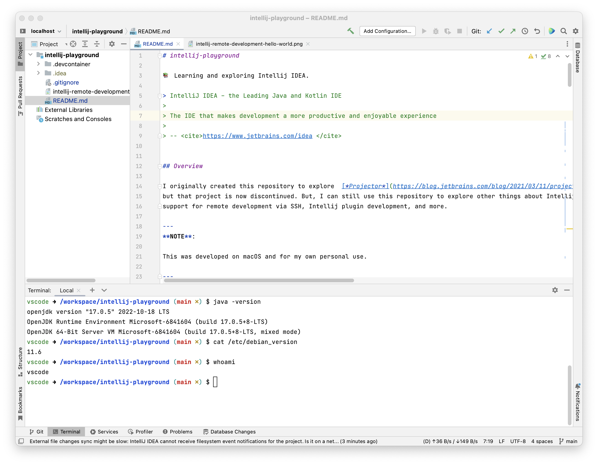

# intellij-playground

📚 Learning and exploring Intellij IDEA.

> IntelliJ IDEA – the Leading Java and Kotlin IDE
> 
> The IDE that makes development a more productive and enjoyable experience
> 
> -- <cite>https://www.jetbrains.com/idea </cite>


## Overview

I originally created this repository to explore  [*Projector*](https://blog.jetbrains.com/blog/2021/03/11/projector-is-out/)
but that project is now discontinued. But, I can still use this repository to explore other things about Intellij like its
support for remote development via SSH, Intellij plugin development, and more.

---
**NOTE**:

This was developed on macOS and for my own personal use.

---


## Container-Based Development via SSH

Intellij and other JetBrains IDEs support [remote development](https://www.jetbrains.com/remote-development/) via cloud
development environments like [JetBrains Space](https://www.jetbrains.com/space/features/dev-environments.html), [GitHub Codespaces](https://github.com/features/codespaces),
or you can [orchestrate your own development environment with SSH](https://www.jetbrains.com/help/idea/remote-development-starting-page.html#start_from_IDE).

Here is a quote from the [JetBrains documentation about remote development](https://www.jetbrains.com/help/idea/remote-development-overview.html):

> Remote development lets you use the IDE interface on a thin client while having a powerful remote host to check out
> and load your project, index, analyze, build, run, debug, and test your code.

I'm a fan of cloud development environments for demos, learning expeditions, and open source collaboration like sharing
reproducible defects but I generally want more control, power, responsiveness, and affordability than what the cloud
offers. With that in mind, we can create a **local container-based development environment** that runs an Intellij
*IDE backend* and connect to it from the *JetBrains Client* via SSH. This is what I've proved out in this repository.

To make sense of the components and how they work together, refer to [this architecture diagram in the Intellij docs](https://www.jetbrains.com/help/idea/remote-development-overview.html#defs).

We need to create a Docker image and container that hosts the IDE backend and is complete with the development tooling
we need to work on our projects. For me, I often work on Java projects and so I depend on an installation of OpenJDK.
Personally, I find Microsoft's [Development Containers](https://containers.dev/) project effective and it shows promise for future
investment and improvement. We can define a dev container configuration file (`.devcontainer/devcontainer.json`) and use
the [Dev Container CLI](https://github.com/devcontainers/cli) to define and build our ideal development environment! Previously,
I have already explored the Development Containers project in the context of VS Code and GitHub Codespaces. You can see
my notes and working examples in my repository <https://github.com/dgroomes/vscode-playground>.

### Instructions

Follow these instructions to create a container-based development environment for Intellij. This follows a variation of
the [*Server-to-client* workflow described by the Intellij remote development docs](https://www.jetbrains.com/help/idea/remote-development-overview.html).
The *Client-to-server* workflow is a little easier to follow and [those instructions are in an earlier version of this README](https://github.com/dgroomes/intellij-playground/tree/7a5d9b095d1b4287d3c9f349611941aab8a7bc62).

1. Pre-requisite: [JetBrains Gateway](https://www.jetbrains.com/help/idea/remote-development-a.html#gateway)
2. Pre-requisite: npm
   * I'm using npm version 9.2.0.
3. Pre-requisite: Docker
   * I'm using Docker Desktop 4.15.0
4. Download the Intellij IDE Backend
    * First, you need to download a distribution of Intellij from JetBrains. There are a few paths you can take to do that.
      I won't detail the specific steps I chose because there isn't a perfect way to do this. The easiest interactive way
      to download a distribution is via the [*Other Versions* download page](https://www.jetbrains.com/idea/download/other.html)
      where you can browse the options and choose a specific distribution, like Intellij IDEA Ultimate for Linux AARCH64.
      Alternatively, to do a headless installation, you can try using the `jetbrains-clients-downloader` CLI tool which
      can be used to download any and all JetBrains products. It is not documented well, and it's documented only briefly
      in the JetBrains' *Code With Me* product docs in a doc page named [*Offline (local storage) mode*](https://www.jetbrains.com/help/cwm/guest-local-storage-setup.html).
      So, this installation path doesn't seem very official and will likely change in the near future. Use your discretion
      to choose the method that's best for you.
    * Put the unzipped distribution in a local subdirectory `.devcontainer/idea-distribution/`. This directory is ignored.
      The distribution will be copied into the dev container Docker image. 
5. Install the *Dev Container CLI*
   * ```shell
     npm install --location=global @devcontainers/cli
     ```
6. Build the image
   * ```shell
     devcontainer build --workspace-folder . --image-name intellij-playground-devcontainer
     ```
   * This did a lot of heavy lifting for us. It created a Docker image that is installed with OpenJDK and an SSH server.
     All we had to do was declare that we wanted those features in our `.devcontainer/devcontainer.json` configuration
     file. Alternatively, you are always free to create your own `Dockerfile` and related installation scripts but these
     are notoriously difficult to maintain and debug. Dev Containers has implemented many of these gnarly installation
     scripts, like [this one for Java](https://github.com/devcontainers/features/blob/2af02c198adabacff30c400b0bfcad972ce5abcc/src/java/install.sh)
     and [this one for Python](https://github.com/devcontainers/features/blob/2af02c198adabacff30c400b0bfcad972ce5abcc/src/python/install.sh).
     In my view, the biggest value proposition of the Dev Containers project is the effort and commitment they have exerted
     into maintaining these installation scripts.
7. Create and start a container from the image
   * ```shell
     docker run --rm --name intellij-playground-devcontainer --publish 2222:2222 --detach --mount type=bind,source="$PWD",target=/workspace/intellij-playground intellij-playground-devcontainer /usr/local/share/ssh-init.sh sleep infinity
     ```
   * The peculiarities of this command are something you need to understand and research by reading the Dev Container docs
     and *feature* installation scripts like [the SSH server `install.sh` script](https://github.com/devcontainers/features/blob/b9bfe406d211ce5645a165a73b72048e9ea9e88e/src/sshd/install.sh).
     As time goes on, the Dev Container CLI, the Dev Container spec, and surrounding tooling like VS Code and perhaps Intellij
     (although [JetBrains has not committed to Dev Containers as of yet](https://youtrack.jetbrains.com/issue/IDEA-202267/Support-development-in-Docker-as-in-VM))
     will improve so that we don't need to understand these implementation details.
   * Note: At this point, we've ejected from the Dev Container CLI. For the rest of the worfklow we use the Docker image
     and the `docker` CLI directly. I'm not particularly interested in reading the source code for the Dev Container CLI,
     but at some point I might get there.  
8. Set a password for the non-root dev container Linux user
   * ```shell
     docker exec --interactive --tty intellij-playground-devcontainer passwd vscode
     ```
   * Create a password to your liking. Note: I'm following a workflow here that's similar to the instructions for the ["SSH Server" Dev Container feature](https://github.com/devcontainers/features/tree/main/src/sshd)
     but confusingly, there is a much richer (but maybe outdated?) documentation page [in a VS Code-specific page](https://github.com/microsoft/vscode-dev-containers/blob/main/script-library/docs/sshd.md).
     Read that page.
   * Note: The Dev Container CLI and Dev Container SSH feature have created a non-root user called `vscode`. That's not
     very "standards-body". The VS Code and Microsoft influence is strong here, but we'll take it.
9. Start the IDE backend remote dev server via an SSH connection
   * Note: This is an awkward dev flow, but it works.
   * Start an SSH-based shell session with the container with the following command. Use the same user password you
     created earlier.
   * ```shell
     ssh -p 2222 -o StrictHostKeyChecking=no -o UserKnownHostsFile=/dev/null -o GlobalKnownHostsFile=/dev/null vscode@localhost
     ```
   * While in the SSH shell session, start the IDE backend with the following command. Note that the command includes the
     path to the project on the container's file system: `/workspace/intellij-playground`.
   * ```shell
     /opt/idea/bin/remote-dev-server.sh run /workspace/intellij-playground --ssh-link-host localhost --ssh-link-port 2222 --ssh-link-user vscode
     ```
   * Verify that the command executed normally and did not output any error logs. If it executed normally, the log
     output should include a *Gateway link*. It should look something like the following.
   * ```text
     $ /opt/idea/bin/remote-dev-server.sh run /workspace/intellij-playground --ssh-link-host localhost --ssh-link-port 2222 --ssh-link-user vscode
     
     ... omitted ...
     
     *********************************************************
     
     Join link: (ignore this)
     
     Http link: (ignore this)
     
     Gateway link: jetbrains-gateway://connect#idePath=%2Fopt%2Fidea&projectPath=%2Fworkspace%2Fintellij-playground&host=localhost&port=2222&user=vscode&type=ssh&deploy=false
     
     ********************************************************* 
     ```
10. Open the project via the Gateway link
    * Paste the Gateway link into your browser and your browser will launch your local JetBrains Gateway application with
     special arguments that point it to the remote dev server's port and project path. That data is embedded in the URL. 
11. Develop and Explore
    * Enjoy your development experience in the dev container.
    * For example, notice the terminal output in the following screenshot. It shows a regular-looking Intellij window
      that's opened on the `intellij-playground` project. The GUI process is running on your host using the Intellij
      Client but the main IDE engine is running in the dev container. The shell running in the embedded terminal is also
      running in the dev container. Notice the commands and their output in the terminal.

    


12. When you're done, stop the container
    * ```shell
      docker stop intellij-playground-devcontainer
      ```
    * Because we started the container with the `--rm` flag, the container will be deleted when it stops.


## Wish List

General clean-ups, changes and things I wish to implement for this project:

* [x] ABANDONED (I don't think this will work on macOS but I tried) Run Projector without Docker. Maybe this will avoid the JVM crash.
* [ ] Merge my project <https://github.com/dgroomes/intellij-plugin-playground> as a sub-project to this Git repo.
* [x] DONE Remove Projector stuff. That project was discontinued and is now part of the closed-source product Gateway (which is
  totally fine; JetBrains can do what they need to do to stay competitive) 
* [x] DONE Create a container-based development environment. Use JetBrains Gateway. Use Dev Containers. Describe
  all instructions.
* [ ] BLOCKED (The Dev Container CLI has not yet implemented the `forwardPorts` part of the spec. See [GitHub issue #186](https://github.com/devcontainers/cli/issues/186))
  Consider using the Dev Container CLI to run the container. This is convenient because it should do the bind
  mounting and the port forwarding (you still have to configure the ports manually in `.devcontainer/devcontainer.json`).
* [x] DONE Mount the project directory file system into the container. This is what VS Code does for its Dev Containers
  experience. I'm afraid about how slow this will make the dev experience because the Docker on macOS file system sharing
  is notoriously slow, and Intellij does heavy IO because of its advanced indexing.
* [x] DONE (Update: yes, but it trades off some steps with other steps) Can I build a ready-to-go image, above and beyond the dev containers one I created, that's pre-installed with Intellij?
  I have many projects. I don't want to continually download Intellij (it's 1+ GB). I think I need to use the "JetBrains Client Downloader" (?)
  mentioned on the [*Fully offline mode* page](https://www.jetbrains.com/help/idea/fully-offline-mode.html)


## Reference

* [JetBrains Gateway](https://www.jetbrains.com/help/idea/remote-development-a.html#gateway)
* [Development Containers](https://containers.dev/)
* [Dev Container CLI](https://github.com/devcontainers/cli)
* [JetBrains feature request "IDEA-202267": *Support development in Docker as in VM*](https://youtrack.jetbrains.com/issue/IDEA-202267/Support-development-in-Docker-as-in-VM)
  * Follow this issue to understand and stay updated on JetBrains' plans for container-based development.
